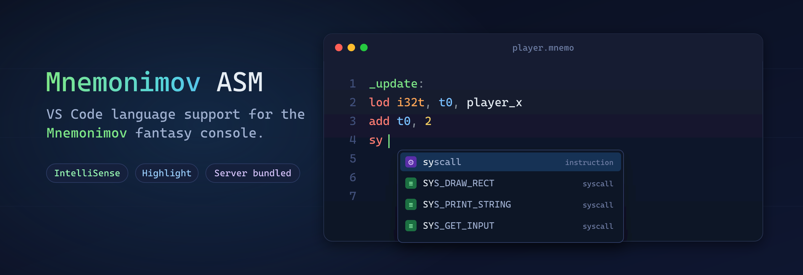

<div align="center">



<br/>

**Full language support for MISA / Mnemonimov assembly in VS Code — syntax highlighting plus a bundled C++ language server. Install and go.**

<br/>

[](https://marketplace.visualstudio.com/items?itemName=RustyAstroboy.mnemonimov-asm)
[](https://github.com/mariusvn/vscode-menmonimov-asm/releases/latest)
[](https://github.com/mariusvn/vscode-menmonimov-asm/actions/workflows/ci.yml)
[](LICENSE.md)

[**Features**](#-features) · [**Install**](#-install) · [**Settings**](#%EF%B8%8F-settings) · [**Build**](#%EF%B8%8F-build-from-source) · [**How it works**](#-how-it-works) · [**Language**](#-language-at-a-glance) · [**Changelog**](CHANGELOG.md)

</div>

---

## ✨ Features

Beyond syntax highlighting, the extension bundles the [**MISA Language Server**](https://github.com/mariusvn/MISA-LSP) and wires it up automatically — no toolchain, no configuration.

| | Capability | What it does |
|:--:|:--|:--|
| 🎨 | **Syntax highlighting** | TextMate grammar covering the full MISA instruction set (manual v0.1.6), registers, directives, `include` paths and virtual folders, types, conditions, syscalls, character literals and escapes |
| 📚 | **Multi-file projects** | Follows `include "…"` recursively (each file once), resolves `@u/` and `@s/`, and analyses a library through its project's `main.asm` — so symbols from other files are known everywhere |
| 🩺 | **Diagnostics** | Syntax errors, unknown instructions, wrong arity, `int`/`float` mismatches, immediates as destinations, read-only registers, undefined labels and constants, missing included files, malformed character literals, missing `exit` |
| 💡 | **Hover** | Rich docs for every instruction, register (with ABI role), syscall (args & returns), type, condition and built-in symbol — plus constant values, `'ab'` values, `##` doc comments and the defining file |
| ⌨️ | **Completion** | **Context-aware** — types after `lod`/`ste`, conditions after `cmp`, `SYS_*` after `syscall`, registers and symbols from every included file in operand slots |
| 🧭 | **Go to definition** | Jump to any label or constant across files, qualified names included (`PRINTER.MAPPING`), or open an included file |
| 🔎 | **Find references** | Every use of a label or constant across all the files of the program |
| 🔗 | **Document links** | Click `include` and `emb file` paths to open them |
| 🗂️ | **Document symbols** | Outline with entry-points highlighted and locals nested under their scope |
| 📐 | **Folding** | Label scopes, `bmk`/`sbmk` sections, doc-comment blocks |

> 🛰️ The language server is shipped **prebuilt inside the `.vsix`** — installing the extension is all you need.

---

## 📦 Install

<details open>
<summary>🛒 <b>VS Code Marketplace</b> (recommended)</summary>

<br/>

Search **Mnemonimov ASM** in the Extensions view, or install it from the
[**Marketplace page**](https://marketplace.visualstudio.com/items?itemName=RustyAstroboy.mnemonimov-asm) — updates land automatically.

```bash
code --install-extension RustyAstroboy.mnemonimov-asm
```

</details>

<details>
<summary>⬇️ <b>Download the latest <code>.vsix</code> release</b></summary>

<br/>

Grab the prebuilt `.vsix` from the [**latest GitHub release**](https://github.com/mariusvn/vscode-menmonimov-asm/releases/latest), then:

```bash
code --install-extension mnemonimov-asm-<version>.vsix
```

Or in VS Code: **Extensions** → `···` menu → **Install from VSIX…**

</details>

Open any `.asm`, `.misa` or `.mnemo` file and the server starts automatically. That's it — diagnostics, hover and completion light up immediately.

| Extension | Language |
|-----------|----------|
| `.asm`    | Mnemonimov Assembly |
| `.misa`   | Mnemonimov Assembly |
| `.mnemo`  | Mnemonimov Assembly |

---

## ⚙️ Settings

| Setting | Default | Description |
|:--|:--|:--|
| `mnemonimov.userProjectsPath` | `""` | Folder behind the `@u/` virtual folder. Empty = auto-detect (`%APPDATA%/Mnemonimov/user_projects` on Windows, `~/.local/share/Mnemonimov/user_projects` on Linux). |
| `mnemonimov.sampleProjectsPath` | `""` | Folder behind the `@s/` virtual folder. Empty = auto-detect from the Steam install (`…/steamapps/common/Mnemonimov/sample_projects`). |
| `mnemonimov.serverPath` | `""` | Absolute path to a custom `misa-lsp` executable. Leave empty to use the binary bundled with the extension. |

`serverPath` is handy when hacking on the language server — point it at your own build instead of repackaging the extension.
Run **Mnemonimov: Restart Language Server** from the Command Palette to restart it at any time.

> 💡 Open the **project folder** (the one containing `project.mnemonimov`) in VS Code: a library opened on its own
> is then analysed through the project's `main.asm`, and edits to closed included files are picked up.

---

## 🛠️ Build from source

The language server lives in the [`MISA-LSP`](https://github.com/mariusvn/MISA-LSP) **git submodule** and is compiled into `bin/` at package time.

```bash
# 1. Clone with the LSP submodule
git clone --recursive https://github.com/mariusvn/vscode-menmonimov-asm.git
cd vscode-menmonimov-asm

# 2. Install dependencies
npm install

# 3. Build the language server (compiles the submodule, copies the binary to bin/)
npm run build-lsp

# 4. Package the extension
npx @vscode/vsce package        # → mnemonimov-asm-<version>.vsix
```

<details>
<summary>📦 <b>Prerequisites</b></summary>

<br/>

- **Node.js** (18+) & npm
- **CMake** ≥ 3.20
- A **C++20** compiler — MSVC 2022, GCC 12+, or Clang 15+
- Internet on the first LSP build (nlohmann/json is fetched automatically)

</details>

<details>
<summary>🧩 <b>Already cloned without <code>--recursive</code>?</b></summary>

<br/>

```bash
git submodule update --init --recursive
```

`npm run build-lsp` also initializes the submodule for you if it's missing.

</details>

<details>
<summary>🐛 <b>Develop & debug</b></summary>

<br/>

Press **F5** in this folder to launch an Extension Development Host with the extension loaded. `npm run watch` rebuilds `out/extension.js` on save. View server logs via **Output → Mnemonimov Language Server**.

</details>

---

## 🔧 How it works

The extension is a thin TypeScript client; all the language intelligence comes from the bundled server, which it spawns over **JSON-RPC 2.0 / stdio**.

```
   ┌──────────────────── VS Code ────────────────────┐
   │  out/extension.js  (vscode-languageclient)        │
   │      │                                            │
   │      │  spawn + JSON-RPC 2.0 over stdio           │
   │      ▼                                            │
   │  bin/misa-lsp(.exe)   ◄── built from the          │
   │      MISA-LSP submodule (C++20)                    │
   └───────────────────────────────────────────────────┘
```

```text
src/extension.ts   LSP client — resolves the server & starts the session
scripts/build-lsp.js   builds the submodule (Release) → copies binary to bin/
syntaxes/          TextMate grammar
MISA-LSP/          git submodule → github.com/mariusvn/MISA-LSP
bin/               bundled server binary (generated, git-ignored)
out/               bundled extension (esbuild, git-ignored)
```

**Server resolution order** (`src/extension.ts`): the `mnemonimov.serverPath` setting → the bundled `bin/` binary → a local submodule `build-release/` (dev fallback).

Packaging (`vscode:prepublish`) runs `build-lsp` then bundles the client with esbuild, so the `.vsix` ships only `bin/misa-lsp.exe` and `out/extension.js` — no source, no `node_modules`.

---

## 📝 Language at a glance

```misa
include "lib/math.asm"        # relative to this file · "@u/lib/main.asm" · "@s/lander/main.asm"

## Move the player and bounce it off the screen edge.
def SPEED 2

player_x: emb i32t 160        # data label, inspectable in the debugger

_update:
    lod  i32t, t0, player_x   # load  (types: i8t/u8t/…/f32t)
    add  t0, SPEED            # compact form: t0 += SPEED
    cmp  gte, t0, SCREEN_WIDTH
    jtr  .wrap
    str  i32t, player_x, t0
    exit
.wrap:
    str  i32t, player_x, zr   # zr always reads 0
    exit
```

| | |
|:--|:--|
| **Files** | `.asm`, `.misa`, `.mnemo` · `include "path"` (recursive, each file once) |
| **Comments** | `#` line · `##` doc-comment |
| **Integers** | `42` · `0x2a` · `0b101010` · `0o52` · `10_000` |
| **Characters** | `'a'` · `'misa'` (up to 4, packed big-endian) · escapes `\0 \t \n \' \" \\` |
| **Floats** | `3.14` (no scientific notation) |
| **Strict typing** | `add 1.0` ❌ (wants int) · `fadd 1` ❌ (wants float) |
| **Labels** | global `foo:` · local `.bar:` · reusable `@loop:` + `@loop-` / `@end+` |

---

## 🤝 Contributing

Issues and pull requests are welcome! Language behaviour lives in the [MISA-LSP](https://github.com/mariusvn/MISA-LSP) repository — fixes to diagnostics, hover or completion belong there. This repo owns the VS Code integration and the TextMate grammar.

## 🧠 Development note

This project was built with the assistance of AI coding tools (Claude Code). The architecture, code, and integration were directed, reviewed, and validated by a human — including against real-world MISA programs.

## 📄 License

Released under the [**MIT License**](LICENSE.md).

<div align="center"><sub>Made for the Mnemonimov community · happy hacking 🎮</sub></div>
